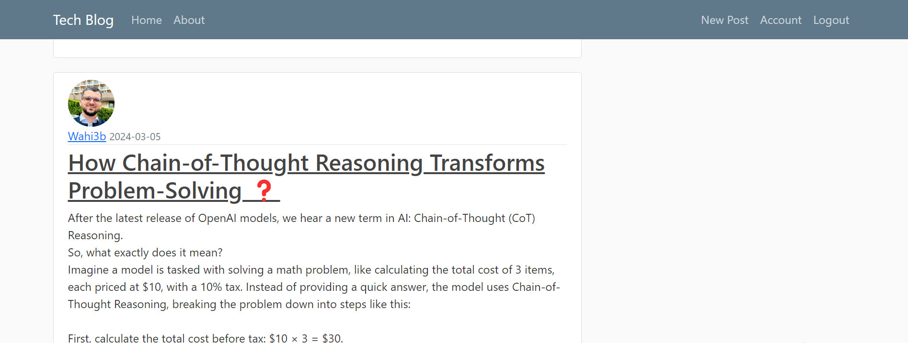
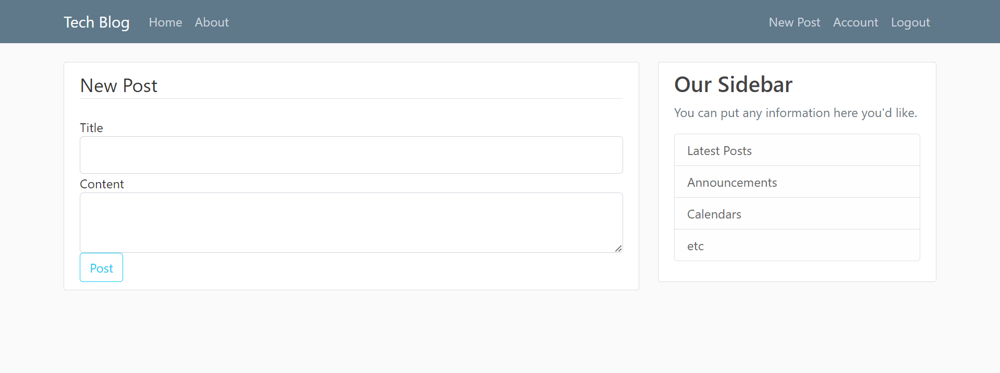

# Flask Blog Site

This is a robust blog site developed using Flask, designed to provide users with a seamless experience for registering, logging in, creating posts, and managing their accounts. The application incorporates essential CRUD (Create, Read, Update, Delete) operations for blog posts, alongside secure user authentication features.

## Features

- **User Authentication:** Secure registration and login processes, utilizing hashed passwords to protect user data.
- **User Profiles:** Users can update their profile information, including the ability to upload a profile picture.
- **Blog Posts:** Comprehensive management of blog posts, allowing users to create, view, update, and delete their contributions.
- **Pagination:** Posts are organized with pagination for improved navigation and accessibility.
- **Password Reset:** Users can request a password reset via email, ensuring account security.
- **User-Specific Pages:** Navigate through posts authored by specific users, enhancing user engagement.

## Project Structure

The application has been refactored to utilize Blueprints, promoting modularity and maintainability:

- **app.py:** The main application file where the central application instance is created and configured.
- **blueprints/:** Contains modular Blueprints for:
  - **users:** Manages user authentication and profile functionalities.
  - **posts:** Handles all operations related to blog posts.
  - **main:** Serves the home page and other core routes.
- **models.py:** Defines the database models for User and Post.
- **forms.py:** Contains the WTForms for registration, login, account updates, post creation, and password reset.
- **templates/:** Directory housing HTML templates for rendering views.
- **static/:** Directory containing static files, such as CSS and profile images.

## Dependencies

- Flask
- Flask-SQLAlchemy
- Flask-Bcrypt
- Flask-Login
- Flask-Mail
- Flask-WTF
- Pillow

## Usage

### Home Page

The home page showcases all blog posts with pagination, allowing users to easily browse through older posts.

### User Registration and Login

Users can register and log in through dedicated forms. Once logged in, users gain access to additional features, including post creation, editing, and deletion.

### Creating and Managing Posts

Users can create new posts, as well as update or delete their existing contributions. Each post is uniquely linked to the user who created it.

### User Profiles

Each user has a personalized profile page displaying their information and blog posts. Users can update their profile picture, username, and email address.

### Password Reset

In the event of a forgotten password, users can request a reset link via email, enabling them to establish a new password.
